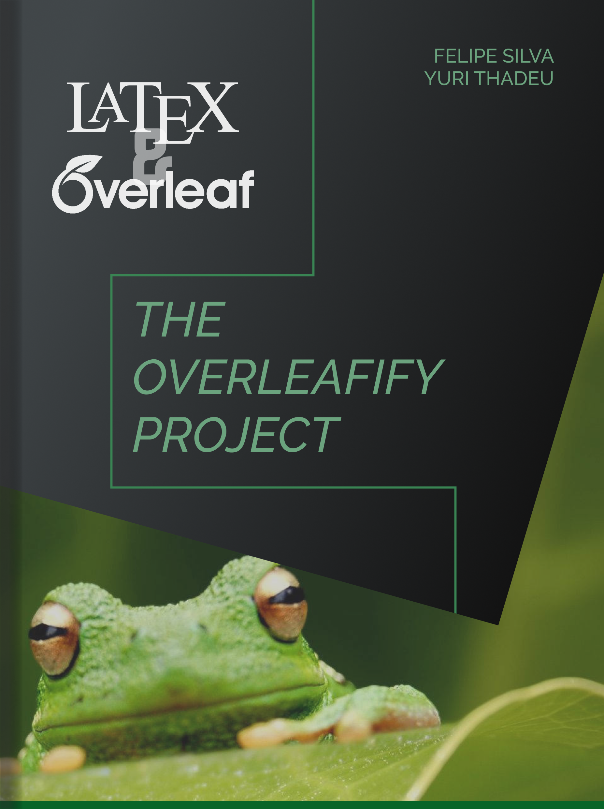

# 📘 The Overleafify Project

*Um guia prático e acessível para dominar LaTeX e Overleaf*

[Português](#-sobre-o-projeto) • [English](#-about-the-project) • [Download](#-como-usar) • [Conteúdo](#-conteúdo-do-livro)

---

## 🇧🇷 Sobre o Projeto

**The Overleafify Project** é um livro didático desenvolvido para o minicurso de LaTeX & Overleaf ministrado na **SIEEL** e no **IEEE Student Branch USP São Carlos**. Este guia foi criado para capacitar estudantes e pesquisadores a produzirem documentos acadêmicos e técnicos de alta qualidade, desde o nível básico até o avançado.

### 📖 Resumo

Este livro é um guia prático e acessível para iniciantes no uso do LaTeX e do Overleaf, ferramentas essenciais para a produção de documentos acadêmicos e técnicos de alta qualidade. Abordamos desde os conceitos básicos, como a estrutura de documentos e formatação de texto, até tópicos avançados, incluindo a criação de tabelas, inserção de imagens, expressões matemáticas, bibliografias e gráficos. 

Além disso, exploramos a criação de apresentações profissionais com o **Beamer** e a personalização de layouts para atender às necessidades específicas de cada projeto. Com exemplos práticos, exercícios e dicas úteis, este guia visa capacitar os novos ingressantes a dominar essas ferramentas de forma eficiente, tornando a documentação científica mais clara, organizada e esteticamente atraente.

### 🎯 Objetivos

- ✅ Introduzir conceitos fundamentais de LaTeX
- ✅ Fornecer exercícios práticos para consolidação do aprendizado
- ✅ Demonstrar aplicações reais em documentos acadêmicos
- ✅ Ensinar criação de apresentações profissionais com Beamer
- ✅ Capacitar para produção autônoma de documentos técnicos

---

## 📚 Conteúdo do Livro

O livro está organizado em capítulos progressivos, cobrindo desde fundamentos até técnicas avançadas:

### Capítulos

| # | Tópico | Descrição |
|---|--------|-----------|
| 1️⃣ | **Tipos de Documentos e Estrutura** | Compreendendo classes, preâmbulo e organização |
| 2️⃣ | **Formatação de Texto** | Fontes, estilos, listas e alinhamento |
| 3️⃣ | **Tabelas** | Criação e formatação de tabelas profissionais |
| 4️⃣ | **Manipulação de Imagens** | Inserção, posicionamento e referências |
| 5️⃣ | **Expressões Matemáticas** | Equações, símbolos e ambientes matemáticos |
| 6️⃣ | **Bibliografias e Citações** | Gerenciamento de referências com BibTeX |
| 7️⃣ | **Layout Profissional** | Personalização e templates avançados |
| 8️⃣ | **Gráficos e Diagramas** | TikZ e visualização de dados |
| 9️⃣ | **Beamer (Apresentações)** | Slides profissionais em LaTeX |

### 📦 Conteúdo Adicional

- **Prefácio**: Contexto e motivação do projeto
- **Introdução**: TeX vs LaTeX, WYSIWYG vs WYSIWYM
- **Apêndice**: Recursos complementares e referências
- **Exemplos práticos**: Códigos prontos para uso
- **Exercícios resolvidos**: Material para prática guiada

---

## 🚀 Como Usar

### Opção 1: Compilar Localmente

Você pode compilar o documento LaTeX localmente no seu computador:

\\\ash
# Clone o repositório
git clone https://github.com/FatsyAlst/the-overleafify-project.git
cd the-overleafify-project

# Entre no diretório do documento
cd latex-doc

# Compile com pdflatex (ou use seu editor LaTeX preferido)
pdflatex main.tex
bibtex main
pdflatex main.tex
pdflatex main.tex
\\\

### Opção 2: Usar no Overleaf

1. Faça upload de todos os arquivos da pasta \latex-doc/\ para um novo projeto no [Overleaf](https://www.overleaf.com)
2. Compile o arquivo \main.tex\
3. Explore e modifique conforme necessário!

### Opção 3: Download Direto

*Em breve: PDF compilado disponível para download direto*

---

## 🛠️ Estrutura do Repositório

\\\
the-overleafify-project/
│
├── latex-doc/                    # Código-fonte LaTeX
│   ├── capitulos/                # Capítulos do livro
│   │   ├── 1_typer_doc_struct.tex
│   │   ├── 2_text_formatacao.tex
│   │   ├── 3_tabelas.tex
│   │   ├── 4_manip_img.tex
│   │   ├── 5_Exp_matematica.tex
│   │   ├── 6_bibli_cite.tex
│   │   ├── 7_layout_profissional.tex
│   │   ├── 8_graf_diagra.tex
│   │   └── 9_beamer(PPX_latec).tex
│   ├── exemplos-beamer/          # Exemplos de apresentações
│   ├── imagens/                  # Recursos visuais
│   ├── main.tex                  # Arquivo principal
│   ├── packages.tex              # Pacotes e configurações
│   ├── prefacio.tex              # Prefácio
│   ├── introducao.tex            # Introdução
│   ├── apendice.tex              # Apêndice
│   └── referencias.bib           # Bibliografia
│
└── README.md                     # Este arquivo
\\\

---

## 👥 Autores

<table>
  <tr>
    <td align="center">
      <a href="https://github.com/FatsyAlst">
         
        <b>Felipe Silva</b>
      </a> 
      Co-autor & Instrutor
    </td>
    <td align="center">
      <b>Yuri Thadeu</b> 
      Co-autor & Instrutor
    </td>
  </tr>
</table>

### 🏛️ Afiliação

**IEEE Student Branch USP São Carlos**  
*Universidade de São Paulo - Campus São Carlos*

---

## 📖 Sobre o Minicurso

Este material foi desenvolvido para o **minicurso de LaTeX & Overleaf** (aproximadamente 3 horas) ministrado em:

- 🎓 **SIEEL** (Semana de Integração dos Estudantes de Engenharia Elétrica)
- 🔬 **IEEE Student Branch USP São Carlos**

O curso cobre desde fundamentos até técnicas avançadas, com foco em exercícios práticos e aplicações reais na documentação científica e acadêmica.

---

## 🎯 Para Quem é Este Material?

- 📚 **Estudantes universitários** iniciando na escrita acadêmica
- 🔬 **Pesquisadores** que precisam produzir artigos e teses
- 👨‍🎓 **Alunos de iniciação científica** aprendendo documentação técnica
- 💼 **Profissionais** que trabalham com documentação técnica
- 🎓 **Qualquer pessoa** interessada em aprender LaTeX do zero

---

## 🌟 Diferenciais

| Característica | Descrição |
|----------------|-----------|
| 📘 **Didático** | Linguagem acessível e progressiva |
| 💡 **Prático** | Exercícios hands-on em cada capítulo |
| 🎨 **Visual** | Exemplos visuais e bem formatados |
| 🆓 **Gratuito** | Material aberto e de livre acesso |
| 🇧🇷 **Em Português** | Conteúdo em português brasileiro |
| ⚡ **Completo** | Do básico ao avançado em um único guia |

---

## 🤝 Contribuindo

Contribuições são bem-vindas! Se você encontrou erros, tem sugestões ou quer adicionar conteúdo:

1. Fork este repositório
2. Crie uma branch para sua feature (\git checkout -b feature/MelhoriaIncrivel\)
3. Commit suas mudanças (\git commit -m 'Adiciona MelhoriaIncrivel'\)
4. Push para a branch (\git push origin feature/MelhoriaIncrivel\)
5. Abra um Pull Request

---

## 📜 Licença

Este livro é distribuído sob uma **licença aberta**. A cópia, reprodução e compartilhamento são permitidos, desde que sejam mantidos os créditos aos autores.

**Copyright © 2025 IEEE Student Branch USP São Carlos**

---

## 📧 Contato

Para dúvidas, sugestões ou mais informações sobre o projeto:

- 📫 Entre em contato através do [IEEE Student Branch USP São Carlos](https://ieee.org/)
- 💬 Abra uma issue neste repositório
- 🔗 Conecte-se no [LinkedIn](https://www.linkedin.com/in/felipe-silva)

---

## 🌐 English Version

### About The Project

**The Overleafify Project** is an introductory and accessible guide to LaTeX and Overleaf, developed as teaching material for a minicourse at SIEEL and IEEE Student Branch USP São Carlos. This book covers everything from basic document structure to advanced topics like mathematical expressions, bibliographies, professional layouts, and Beamer presentations.

### Key Features

- 📖 Comprehensive guide from beginner to advanced
- 💡 Practical exercises in every chapter  
- 🎨 Real-world academic examples
- 🆓 Free and open access
- 🇧🇷 Written in Brazilian Portuguese

### Contents

9 progressive chapters covering:
- Document types and structure
- Text formatting
- Tables and figures
- Mathematical expressions
- Bibliography management
- Professional layouts
- Graphics and diagrams
- Beamer presentations

---

### ⭐ Se este projeto foi útil para você, considere dar uma estrela!

**Made with ❤️ by IEEE Student Branch USP São Carlos**

[⬆ Voltar ao topo](#-the-overleafify-project)

